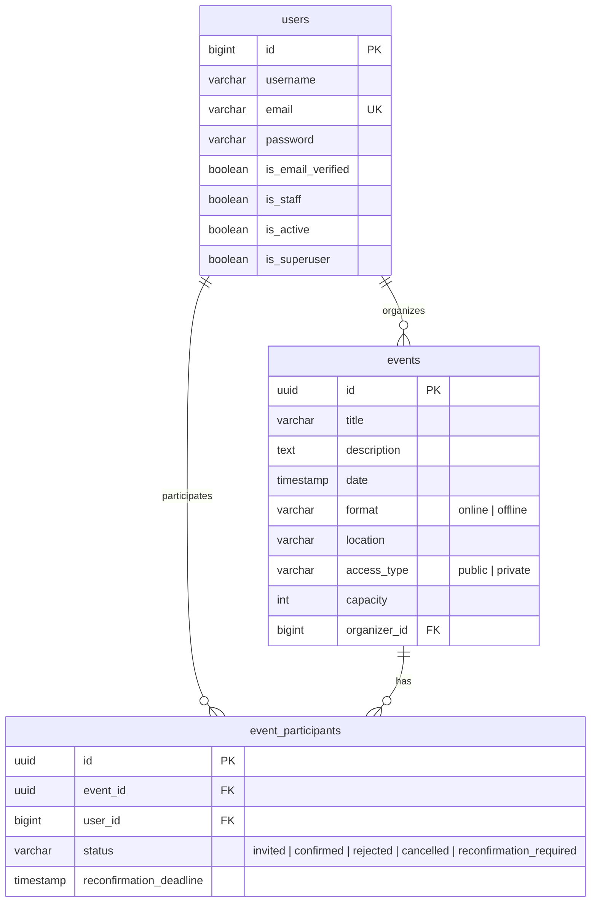

# Event Manager

Django REST API for managing events: create/view/update/delete events, register/invite/accept/reject/cancel participants.

## Setup

### 1. Configure env

```bash
cp .env.example .env
uv run python -c "from django.core.management.utils import get_random_secret_key; print(get_random_secret_key())"
```

Paste the output into `.env` as `DJANGO_SECRET_KEY`, run it again for `JWT_SIGNING_KEY`, and fill in `POSTGRES_USER`/`POSTGRES_PASSWORD`/`POSTGRES_DB`.

### 2. Start everything

```bash
docker compose up --build -d
docker compose run --rm app python manage.py migrate
docker compose exec app python manage.py createsuperuser
```

This starts `db`, `app`, `mailpit`, `redis`, `worker`, and `cron` together — nothing else to run separately:

| Service  | Role |
|----------|------|
| `app`    | Django API — `http://localhost:8000` |
| `db`     | PostgreSQL |
| `mailpit`| Catches outbound email in dev — view at `http://localhost:8025`, no config needed |
| `redis`  | Backs the RQ task queue |
| `worker` | Sends queued emails (verification, password reset, event notifications) |
| `cron`   | Runs the scheduled jobs in `CRONJOBS` (`config/settings.py`): hourly `cleanup_expired_tokens`, and `expire_reconfirmations` every 15 min |

```bash
docker compose logs -f app     # app logs
docker compose logs -f worker  # email-send logs
docker compose logs -f cron    # scheduled-job runs
docker compose down            # stop everything
```

If a queued email never arrives, check `worker` is up. A job that's failed 3 retries lands in RQ's FailedJobRegistry — inspect with `docker compose exec app python manage.py rqstats`.

## Test

```bash
docker compose ps                                   # all 6 services "running"/"healthy"
docker compose run --rm app python manage.py test    # full test suite
```

## Everyday commands

```bash
# migrations
docker compose exec app python manage.py makemigrations users events
docker compose exec app python manage.py migrate

# tests
docker compose run --rm app python manage.py test
```

## API docs

With the app running: `http://127.0.0.1:8000/api/docs/` (Swagger, interactive) · `/api/redoc/` (read-only) · `/api/schema/` (raw OpenAPI YAML).

Auth is cookie-based — log in once and Swagger UI works without pasting a token. If `/api/docs/` shows a bare 401, a stale `access_token`/`refresh_token` cookie is being sent with the schema request itself; clear those two cookies for `127.0.0.1:8000` and reload.

For a hand-written walkthrough of every route (request/response shapes,
error codes, visibility and idempotency rules), see
[`docs/api-reference.md`](docs/api-reference.md).

## Database schema

Core tables per ADR 001, updated to match the actual migrations (the ADR
predates implementation and doesn't list `AbstractUser`'s built-in fields
or the `reconfirmation_deadline` column added since). Auth also adds
`RefreshTokenFamily`/`RefreshTokenRecord`, `EmailVerificationToken`, and
`PasswordResetToken` (ADR 003), all FK'd to `users`.



Want to explore it interactively (drag tables, export SQL/images)? Paste the
DBML block below into [dbdiagram.io](https://dbdiagram.io/).

```dbml
Table users {
  id bigint [pk, increment]
  username varchar(150) [not null]
  email varchar(254) [not null, unique]
  password varchar(128) [not null]

  // AbstractUser fields, not in ADR 001's dbml
  first_name varchar(150)
  last_name varchar(150)
  is_staff boolean [not null, default: false]
  is_active boolean [not null, default: true]
  is_superuser boolean [not null, default: false]
  last_login timestamp
  date_joined timestamp [not null]

  // added since ADR 001 (email verification, §2)
  is_email_verified boolean [not null, default: false]
}

Table events {
  id uuid [pk]
  title varchar(255) [not null]
  description text
  date timestamp [not null]

  format varchar(10) [not null, note: 'enum: online, offline']
  location varchar(255) [note: 'required for offline events, null for online events']

  access_type varchar(10) [not null, note: 'public | private']
  capacity int [not null, note: 'must be > 0']
  organizer_id bigint [not null]

  created_at timestamp
  updated_at timestamp
}

Table event_participants {
  id uuid [pk]

  event_id uuid [not null]
  user_id bigint [not null]

  status varchar(24) [not null, note: 'invited | confirmed | rejected | cancelled | reconfirmation_required']

  // added since ADR 001 (§6 reconfirmation expiry)
  reconfirmation_deadline timestamp [note: 'set when status = reconfirmation_required, else null']

  updated_at timestamp

  indexes {
    (event_id, user_id) [unique]
    (event_id, status)
  }
}

Ref: events.organizer_id > users.id [delete: restrict]

Ref: event_participants.event_id > events.id [delete: cascade]
Ref: event_participants.user_id > users.id [delete: cascade]
```
